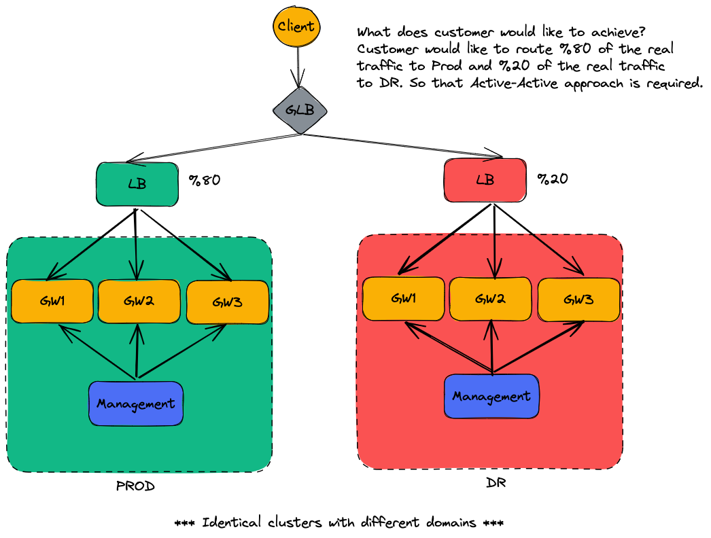
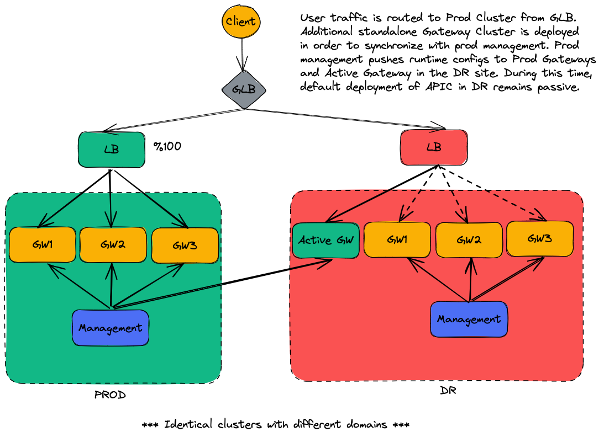
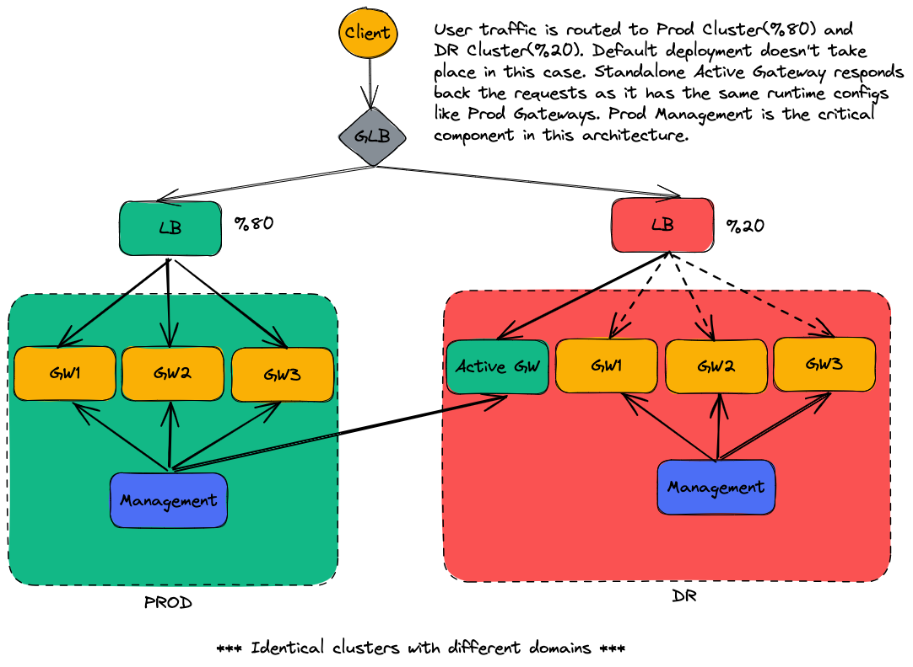
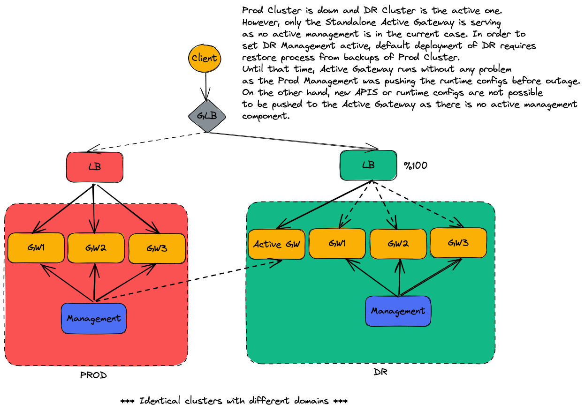

# API Connect Active-Active Disaster Recovery Architecture

## What is Disaster Recovery?
Disaster recovery is the process of maintaining or reestablishing vital infrastructure and systems following

a natural or human-induced disaster, such as a storm or battle. It employs policies, tools, and procedures. (Wikipedia)

As you can see the description of DR(Disaster Recovery) from Wikipedia, that is extremely an important step in case of emergency. However, most of the 

companies push DR into the background. API Connect or similar gateway solutions take an important place sits between client and backend services. 

Therefore, considering DR solutions also for API Connect is critical in order to prevent unexpected outages.

## Official Approach of API Connect for Disaster Recovery

Installing a two data center deployment model is the official and best approach for DR solution as documented: https://github.com/ibm-apiconnect/

apic-hybrid-cloud-enablement/blob/master/docs-and-tools/architecture/APIC-HA-Architectures.md 

However,  best practices might not be the  best solution in some of the cases because of the complexity, lack of computing resources or in some other 

cases, clients or customers just would not like to achieve what is proposed. So that additional approaches or solutions are required for problems.

## What is the problem?

## Scenario 1 - Prod Cluster is the Active (%100)

## Scenario 2 - Prod Cluster(%80) and DR Cluster(%20)

## Scenario 3 - Prod Cluster is down, DR Cluster(%100)

## Scenario 4 - Prod Cluster is down, DR Cluster(%100) is restored

