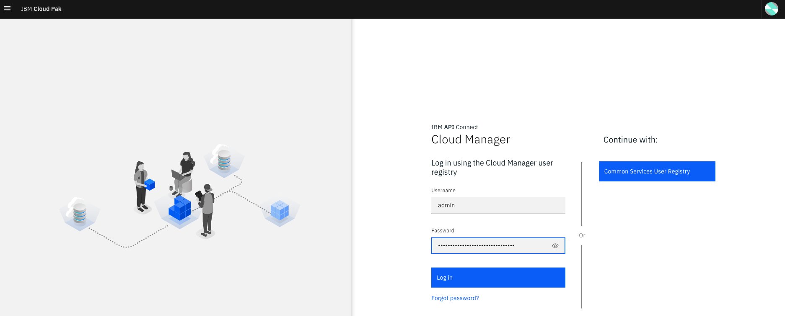
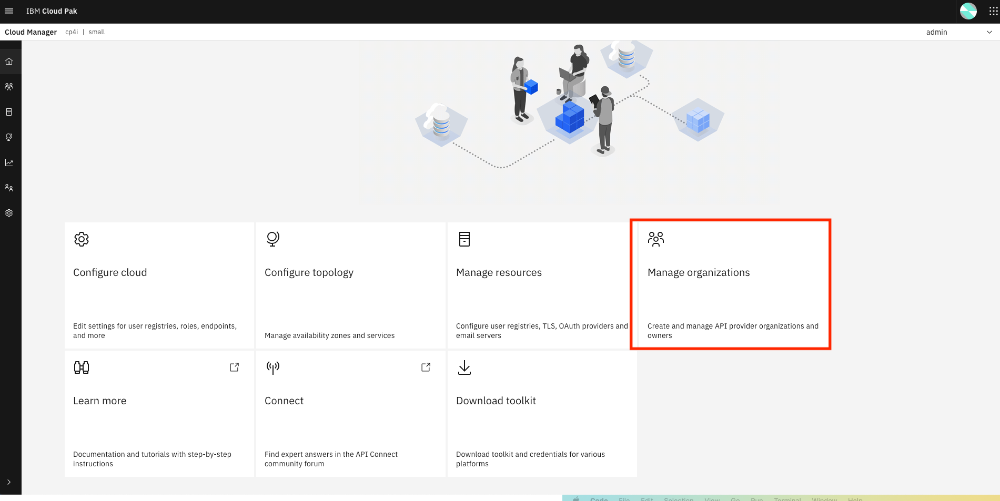
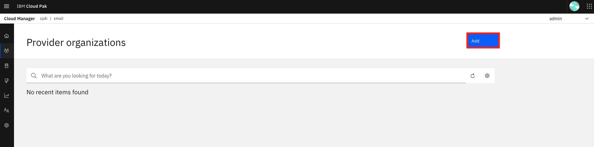
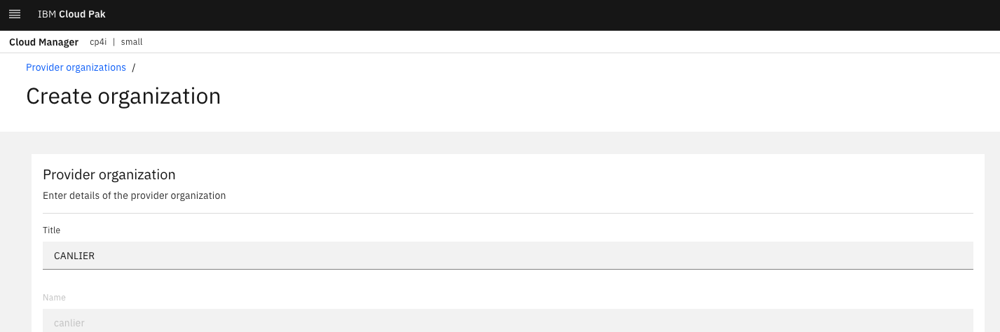
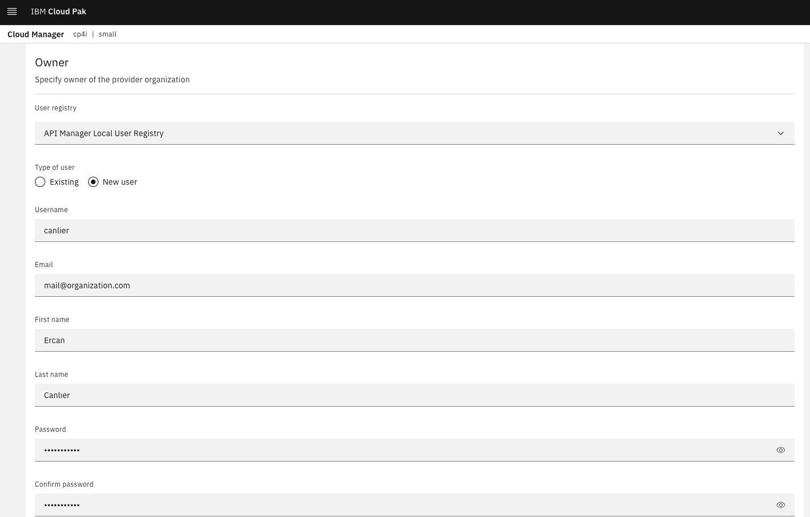
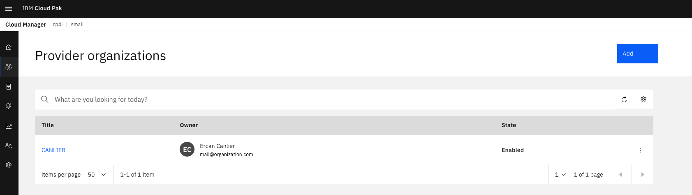
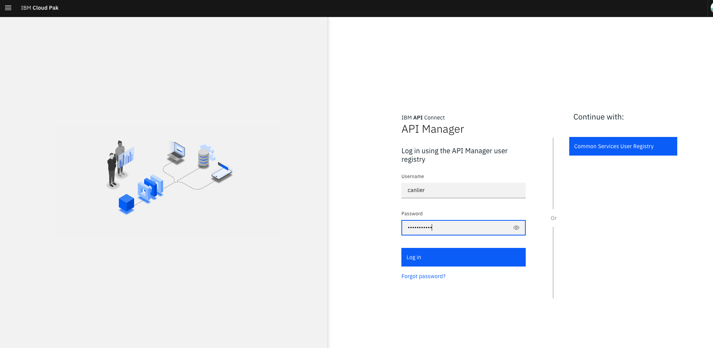
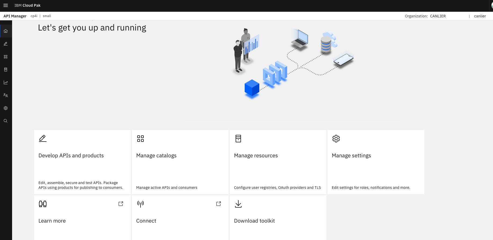

# Lab 1: Setting up your organization

## Purpose of this lab:

By following the steps, this tutorial demonstrates:
- Login to the Cloud Manager.
- Create an Organization.
- Create an Organization Owner for Provider Organization.
- Login to the API Manager.

## Step by step guide:

Follow the steps to set up your organization:

### Step 1. Login to the Cloud Manager

### Step 2. In the homepage, select Manage organizations

### Step 3. Add a Provider Organization
- Select Add -> Create organization.

- Enter an organization name.

- Specify owner of the provider organization.

- List the provider organizations.

### Step 4. Login to the API Manager
- Provide the same username-password pair that you used while creating the owner of organization.

- Explore API Manager dashboard.

**DONE:** You have just finished setting up your organization.