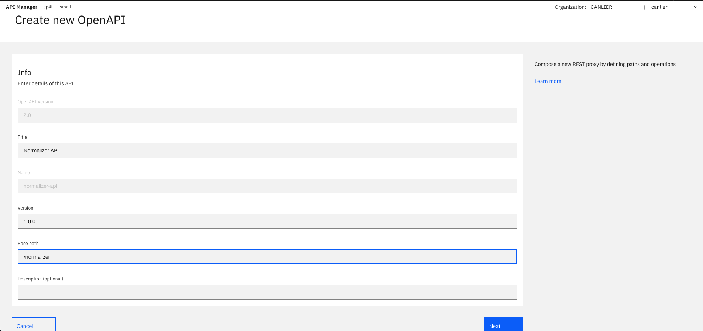
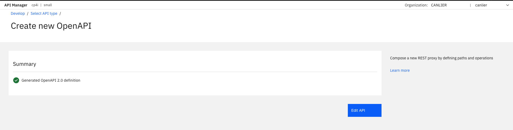
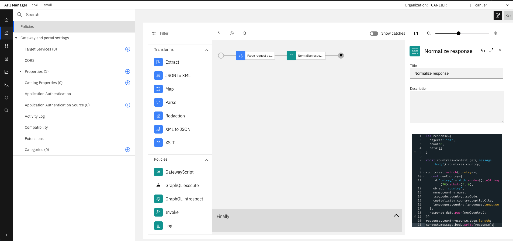
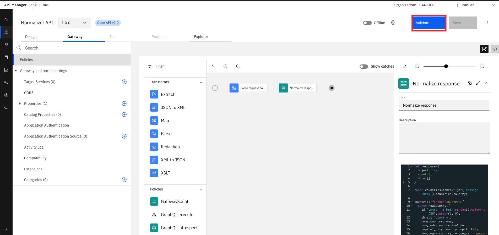
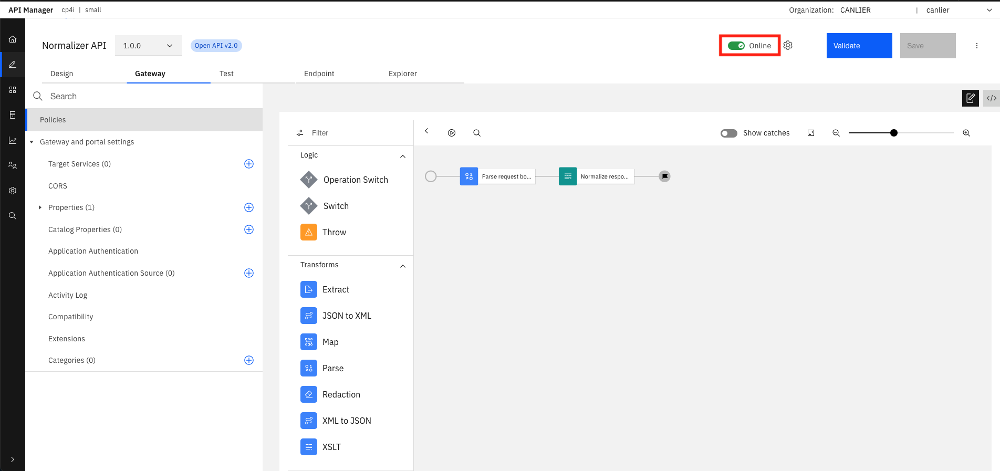
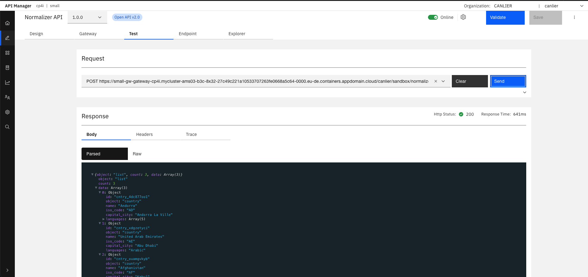

# Lab 5: Developing an API that normalizes the response with gateway script
## Purpose of this lab:

By following the steps, this tutorial demonstrates:
- Create an API that parses the request body and normalizes the response.
- Edit the API definition and add a Parse policy(operation) and Gateway Script policy(operation) to the flow to normalize the response.
- Test the response of your API by posting a JSON body in the request.
  
## Step by step guide:

Follow the steps to create an API that normalizes the response with gateway script.

### Step 1. Create an API Definition

- In the API Manager homepage, select "Develop APIs and products".
  


- Select "Add" to develop API.


- On the "Select API type" page, select "New OpenAPI" and click "Next".


- Enter details of the API and click "Next".




- A summary displays info for API definition.



### Step 2. Edit the API definition and add a "Parse" and "Gateway Script" policy

- Delete "Invoke" policy from the flow.


- Select "Parse" policy and add it to the flow. Rename it to "Parse request body" for better readability.


- Select "GatewayScript" policy and add it to the flow. Rename it to "Normalize response" for better readibility and add below script to the policy. 

```javascript
let response={
  object:'list',
  count:0,
  data:[]
}

const countries=context.get('message.body').countries.country;

countries.forEach(country=>{
  const newCountry={
    id:'cntry_' + Math.random().toString(36).substr(2, 9),
    object:'country',
    name:country.name,
    iso_code:country.isoCode,
    capital_city:country.capitalCity,
    languages:country.languages.language
  };
  response.data.push(newCountry);
})
response.count=response.data.length;
context.message.body.write(response);
```



- Click "Save" to save the changes and "Validate" to validate your API definition.



- Select "Online" to publish the API and test. API will be published to the sandbox.



### Step 3. Test the response of your API by using an user defined policy

- Select the "Test" tab and select  POST as an operation.


- Select "Body" and add below JSON as a request body.

```json
{
    "countries": {
        "country": [
            {
                "name": "Andorra",
                "isoCode": "AD",
                "capitalCity": "Andorra La Ville",
                "languages": {
                    "language": [
                        "Catalan",
                        "Spanish",
                        "French",
                        "Gallegan",
                        "Portuguese"
                    ]
                }
            },
            {
                "name": "United Arab Emirates",
                "isoCode": "AE",
                "capitalCity": "Abu Dhabi",
                "languages": {
                    "language": "Arabic"
                }
            },
            {
                "name": "Afghanistan",
                "isoCode": "AF",
                "capitalCity": "Kabul",
                "languages": {
                    "language": "Pushto"
                }
            }
        ]
    }
}
```


- Click "Send" to test the API.


- Verify "Request Body" is the normalized and sent back as a response.

**DONE:** You have just finished developing an API that normalizes the response.

