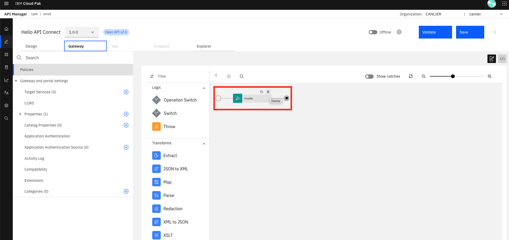

# Lab 2: Developing "Hello API Connect" API

## Purpose of this lab:

By following the steps, this tutorial demonstrates:
- Create a simple API definition.
- Explore the API definition.
- Edit the API definition and add a policy(operation) to the flow.
- Test the response of your very first simple "Hello API Connect" API.

## Step by step guide:

Follow the steps to develop and test your very first API:

### Step 1. Create a simple API definition

- In the API Manager homepage, select "Develop APIs and products".
  


- Select "Add" to develop API.


- On the "Select API type" page, select "New OpenAPI" and click "Next".


- Enter details of the API and click "Next".


- Configure the security for the API and click "Next".


- A summary displays info for API definition.


### Step 2. Explore the API definition

- Select "Edit API" to open the API editor. The first tab "Design" displays details about the API definition.


- "Gateway" tab displays the operations in the API. "Policy" term is used for operations in API Connect.


### Step 3. Edit the API definition

- Delete "Invoke" policy from the flow.



- Select "GatewayScript" policy and add it to the flow. Rename it to "Set response" for better readability.


- Add below gateway script to the policy.
  
```javascript
const response="Hello, API Connect!";

context.message.body.write(response);
```

- Click "Validate" to validate your API definition.


- Select "Online" to publish the API and test. API will be published to the sandbox.


### Step 4. Test "Hello API Connect" API

- Select the "Test" tab and click "Send" to test the API.


**NOTE:** API endpoint displays /organization/sandbox/base-path as /canlier/sandbox/hello for our API.

- Disabled CORS causes this error:


- Enable CORS to pass the error.


- See the "Hello, API Connect" as a response.


**DONE:** You have just finished creating your very first "Hello API Connect" API.
