# Lab 3: Adding additional security to "Hello API Connect" API

## Purpose of this lab:

By following the steps, this tutorial demonstrates:
- Add Client ID security requirements.
- Test the response of your "Hello API Connect" API by providing Client ID.
- Add Client Secret security requirements.
- Test the response of your "Hello API Connect" API by providing Client ID and Client Secret.
  
## Step by step guide:

Follow the steps to add additional security requirements and test your API:

### Step 1. Add Client ID security requirement

- In the API Manager homepage, select "Develop APIs and products".
  

- Select "Hello API Connect" to edit API definition.

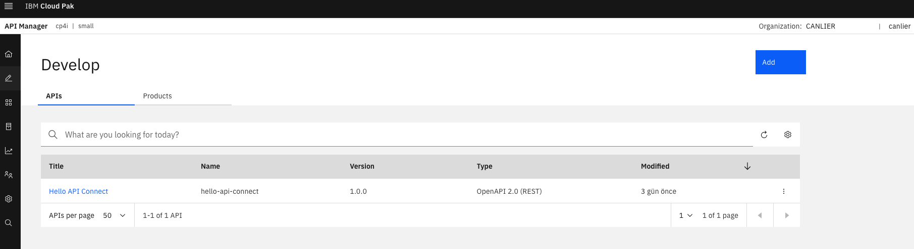

- In the "Design" tab, select "Security Schemes". As it is shown, API hasn't any security scheme definition.

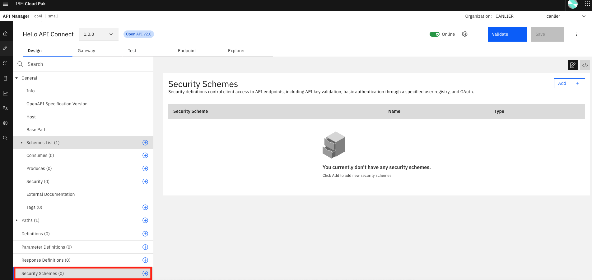

- Click "Add" to add Client ID to "Security Schemes".
  
   Fill in the fields listed below and click "Create":
   - Security Scheme Name (Key): clientID
   - Type: apiKey
   - Key Type(optional): client_id
   - Located in: header
   - Variable name: X-IBM-Client-ID

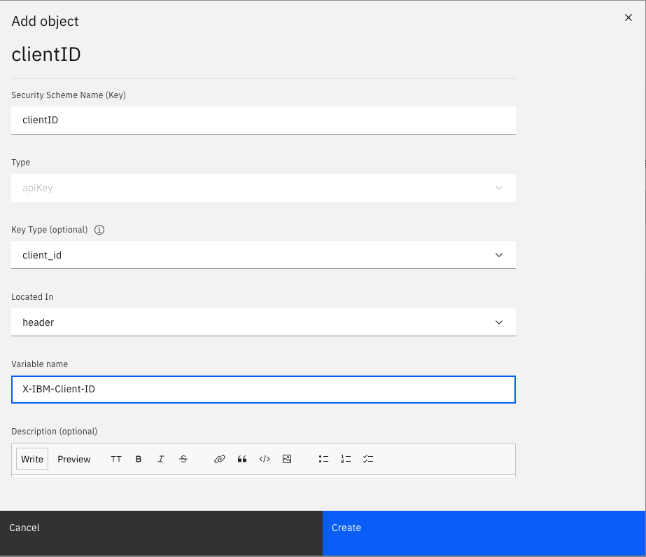
  
- Click "Save" to save the Client ID security scheme definition.

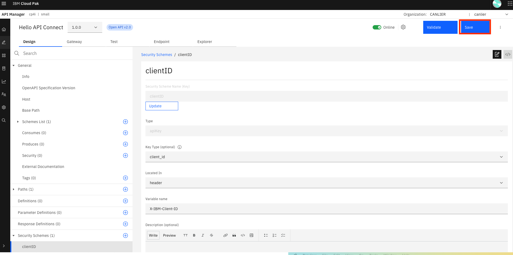

- Select "Security" to list the security requirements for your API.
  

- Select Client ID security scheme to add a security requirement to your API and click "Create".

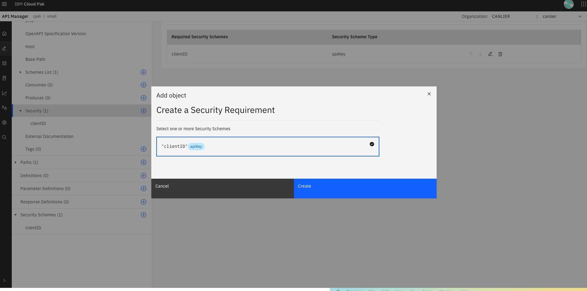

### Step 2. Test "Hello API Connect" API by providing Client ID

- Select the "Test" tab and click "Send" to test the API.

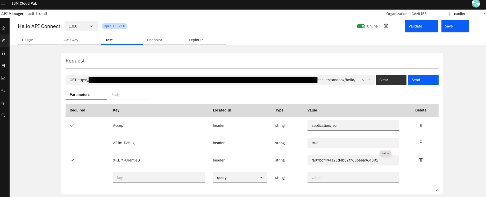

- See the "Hello, API Connect" as a response.

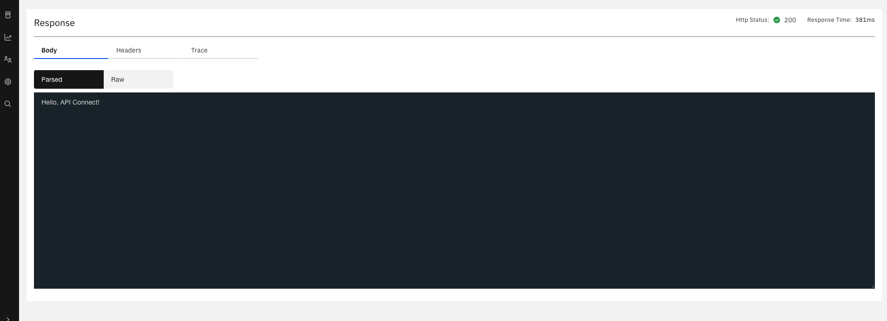

- Delete the X-IBM-Client-ID header from the reuquest and click "Send" to test the API.

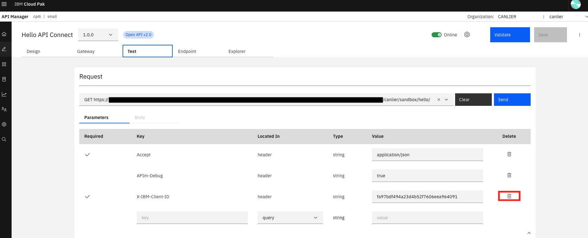

- Verify that requesting the API with missing Client ID security requirement is denied with a "401 Unauthorized Error".

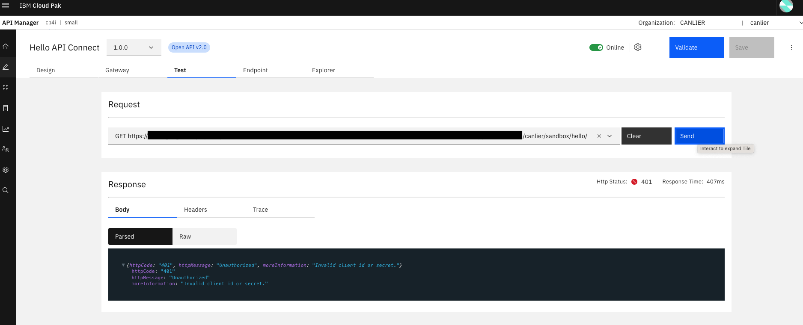

### Step 3. Add Client Secret security requirement 

- Click "Design" and "Security Schemes" again and click "Add +" to add Client Secret as a security scheme.
  
     Fill in the fields listed below and click "Create":
   - Security Scheme Name (Key): clientSecret
   - Type: apiKey
   - Key Type(optional): client_secret
   - Located in: header
   - Variable name: X-IBM-Client-Secret

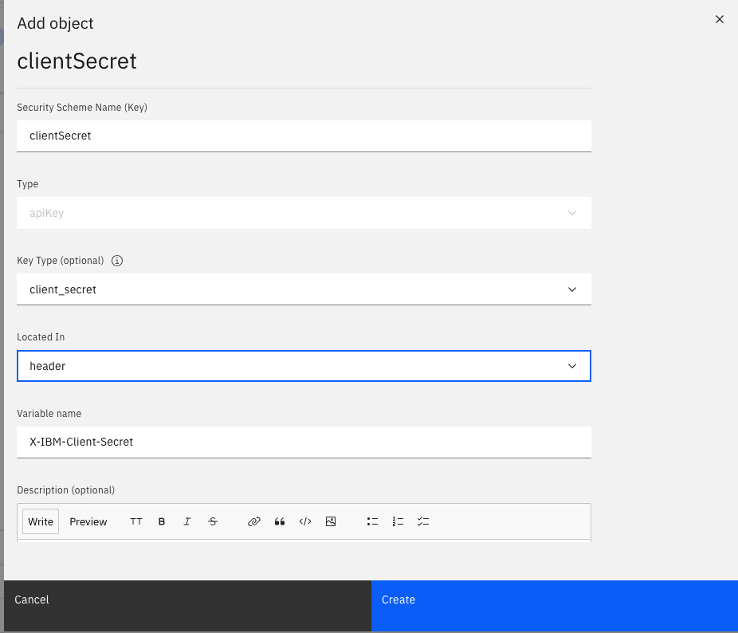

- Click "Save" to save the Client Secret security scheme definition.

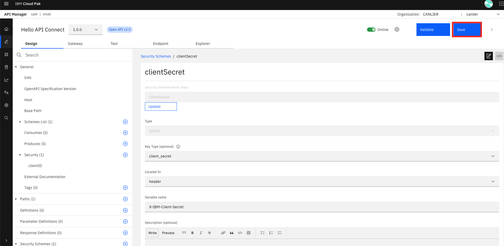

- Select "Security" to list the security requirements for your API.
  
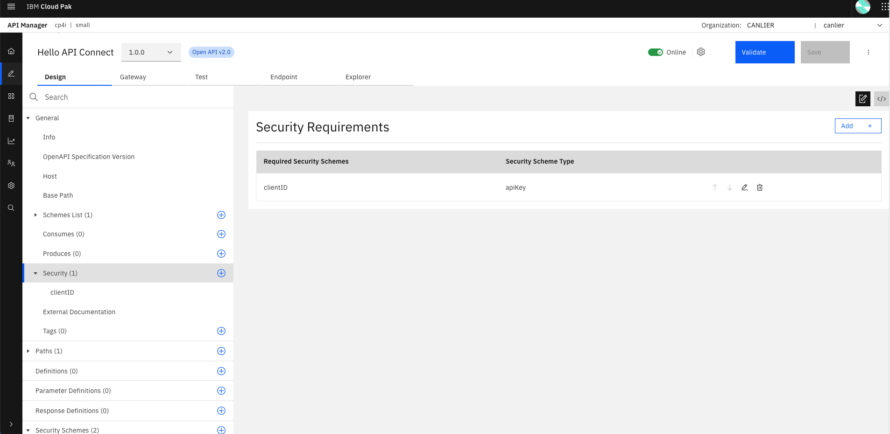

- Select Client Secret security scheme to add a security requirement to your API and click "Submit" and then "Save".

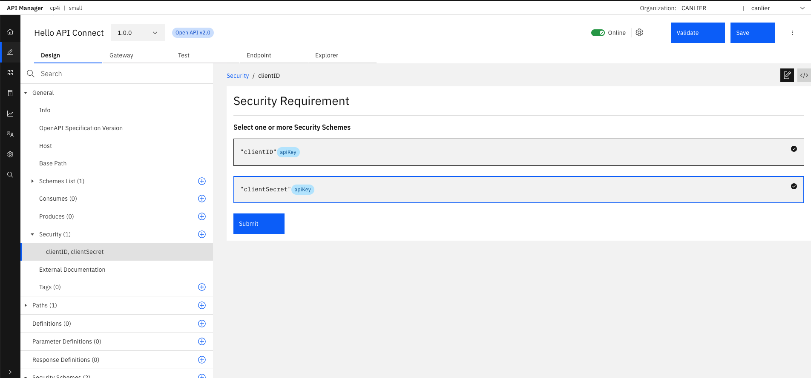

### Step 4. Test "Hello API Connect" API by providing both Client ID and Client Secret

- Select the "Test" tab and click "Send" to test the API.

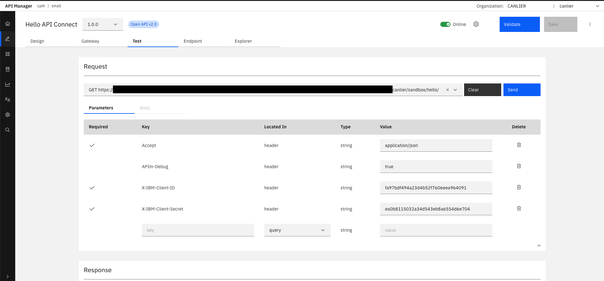

- See the "Hello, API Connect" as a response.

- Delete the X-IBM-Client-Secret header from the reuquest and click "Send" to test the API.

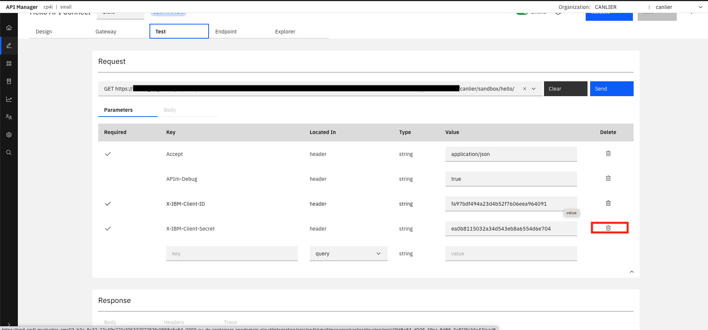

- Verify that requesting the API with missing Client Secret security requirement is denied with a "401 Unauthorized Error" as well as we faced before with Client ID security requirement.

**DONE:** You have just finished adding additional security to "Hello API Connect" API
