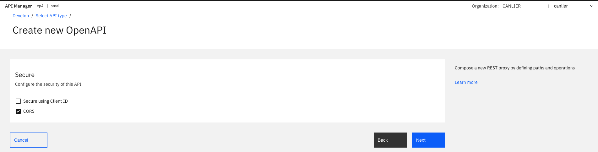

# Lab 4: Developing a loopback REST API that returns the request body as a response

## Purpose of this lab:

By following the steps, this tutorial demonstrates:
- Create a REST API definition.
- Edit the API definition and add a policy(operation) to the flow to return back the request response.
- Test the response of your loopback REST API.
  
## Step by step guide:

Follow the steps to create a loopback REST API and test your API to verify the response is same as request.body:

### Step 1. Create an API definition

- In the API Manager homepage, select "Develop APIs and products".
  

- Select "Add" to develop API.

- On the "Select API type" page, select "New OpenAPI" and click "Next".

- Enter details of the API and click "Next".

- Configure the security for the API and click "Next".

- A summary displays info for API definition.

### Step 2. Edit the API definition and add a "Parse" policy

- Delete "Invoke" policy from the flow.

- Select "Parse" policy and add it to the flow. Rename it to "Parse request body" for better readability.

- Click "Validate" to validate your API definition.

- Select "Online" to publish the API and test. API will be published to the sandbox.

### Step 3. Test "Loopback" API

- Select the "Test" tab and select  POST as an operation.

- Select "Body" and add a request body.

- Click "Send" to test the API.

- See the "Request Body" as a response.

**DONE:** You have just finished creating a loopback API.

